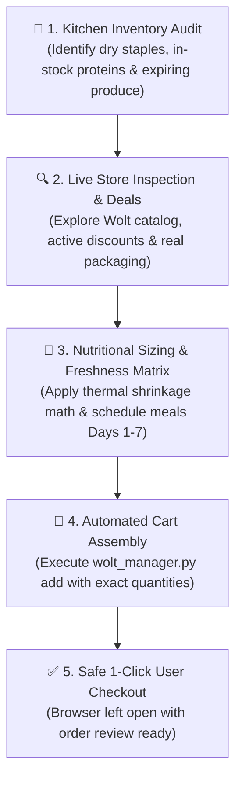

# Wolt Smart Pantry & Grocery Assistant

This skill enables the agent to audit any user's kitchen inventory, explore live store catalogs on Wolt to discover active promotions and in-stock items, dynamically compute required ingredients based on missing meal slots and thermal cooking shrinkage, and automatically assemble an exact grocery cart on Wolt.

---

## 🛠️ System Overview & Core Workflow



---

## 📋 Step-by-Step Instructions

### Step 1: Dynamic Inventory & Stock Audit
When the user shares kitchen photos (fridge, freezer, shelves, pantry) or text inventory:
* **Identify in-stock pantry staples**: Flour, rice, dry pasta, oats, cooking oils, spices, sauces, garlic, leavening agents.
  - *Rule*: Never repurchase staples that are already in stock.
* **Identify existing proteins**:
  - Fresh / chilled meats, poultry, or fish.
  - Frozen meats, seafood, or frozen prepared meals.
  - Shelf-stable proteins: canned tuna/salmon, canned/dry beans, chickpeas, lentils.
  - Dairy & plant proteins: eggs, Greek yogurt, cottage cheese, tofu, tempeh.
* **Identify existing fresh produce & perishability**: Check for open greens or ripe fruits that must be consumed on Day 1–2.
* **Calculate meal slots covered by existing stock**:
  - Example: If the user has eggs and oats, that covers 7 breakfasts. If they have canned tuna and dry pasta, that covers 2 lunches.

### Step 2: Live Store Catalog & Deals Exploration
Before finalizing product recommendations, inspect the target store venue in real time using `wolt_manager.py search` or `wolt_manager.py deals`:

```bash
# Discover live products, exact packaging weights, and current prices in the store:
python wolt_manager.py search --store wolt-market-maakri --queries "hakkliha" "kanafilee" "banaan" "paprika" "rukola"

# Or scan for active store discounts and promotional campaigns:
python wolt_manager.py deals --store wolt-market-maakri
```

The script returns structured JSON detailing live in-stock products, exact packaging weights (e.g. 300g vs 400g vs 500g), prices (€), and price per kg.

### Step 3: Nutritional Sizing, Deals Matching & Freshness Matrix
Using the live store data and formulas from `GROCERY_PLANNING_RULES.md`:
* **Calculate remaining meal slots**:
  $$\text{Missing Main Meals} = (\text{Days} \times \text{Main Meals per Day}) - \text{Meals Covered by In-Stock Goods}$$
* **Thermal Shrinkage Factor**: Raw meat and fish lose 20–35% mass during cooking:
  $$\text{Raw Weight Needed} = \frac{\text{Target Cooked Portion}}{1 - \text{Shrinkage Rate}}$$
  - **Poultry / Red Meat**: ~250g–300g raw per standard meal (~500g–600g for a 2-portion meal prep).
  - **Fish & Seafood**: ~220g–260g raw per standard meal.
  - **Vegetarian (Tofu / Eggs / Beans)**: 150g–200g tofu or 2–3 eggs per meal.
* **Select Best Live In-Stock Items**: Prioritize items on promotion or with the best price-to-weight ratio discovered in Step 2.
* **Freshness Hierarchy (7-Day Consumption Schedule)**:
  - **Days 1–3 (Tier 1: High Perishability)**: Fresh raw minced meat, delicate leafy greens (arugula, spinach), fresh fish.
  - **Days 4–5 (Tier 2: Moderate Shelf-Life)**: Coated/breaded poultry, dense fruit (bananas, refrigerated avocados), sandwich bread.
  - **Days 6–7 (Tier 3 & 4: Hardy Produce & Pantry Backup)**: Thick-skinned vegetables (bell peppers, cherry plum tomatoes, onions, carrots) and pantry/freezer backup meals.

### Step 4: Automated Wolt Cart Assembly
Execute the cart creation automation with exact items and quantities:

```bash
# Add calculated items with explicit quantities:
python wolt_manager.py add --store wolt-market-maakri --items "Rakvere homemade minced meat, 400g:2" "Banaan:6" "Rukola:1" "Paprika punane:2"

# Or pass JSON format:
python wolt_manager.py add --store wolt-market-maakri --json-items "[{\"query\": \"Banaan\", \"qty\": 6}, {\"query\": \"Rakvere homemade minced meat, 400g\", \"qty\": 2}]"
```

---

## 🛡️ Automation Guarantees & Safety Heuristics

1. **Persistent Session (`.wolt_profile`)**: Retains authentication and address settings without cloud IP blocking or captcha walls.
2. **Live Catalog Verification**: Inspects live store availability, eliminating guesswork or outdated hardcoded product names.
3. **Modal Stepper Automation**: Adjusts quantities inside product modals using the `+` stepper button.
4. **Cold-Cut Safety Filter**: Excludes processed sausages, bologna, and cold cuts when looking for real raw meats.
5. **Real-Time Price Verification**: Confirms that the cart total in euros updates after each item.
6. **Safe Checkout**: Leaves the browser open with the cart ready for the user to review. Never submits payment automatically.
