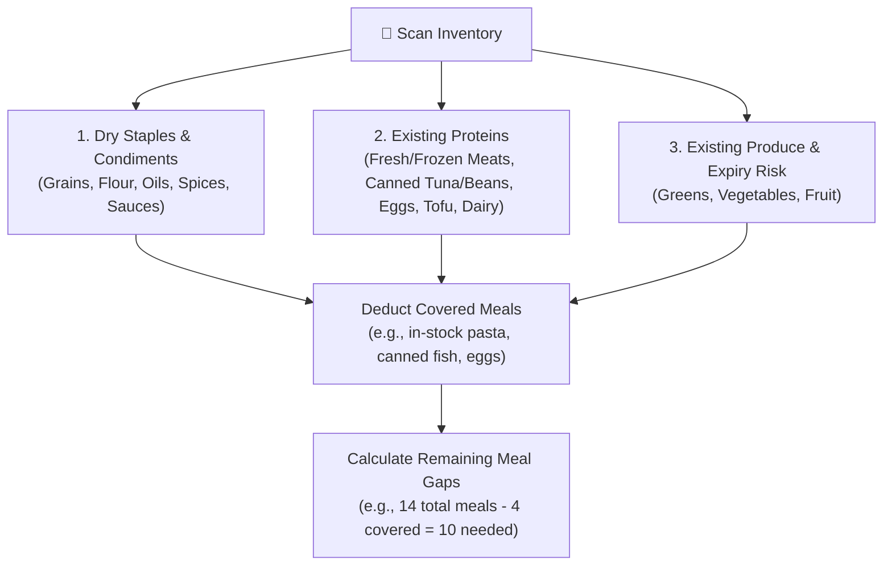

# 📋 Universal Grocery & Meal Planning Rules (Smart Pantry & E-Commerce)

This document defines the mathematical, nutritional, and logistical framework for turning kitchen inventory audits (from images or text) into a personalized, zero-waste weekly shopping list and meal plan for e-commerce delivery platforms (e.g., Wolt, Selver, Rimi).

---

## 🎯 Core Principles

1. **Pantry-First (Zero Duplication)**: Never repurchase spices, oils, grains, or dry goods that already exist in the user's pantry.
2. **Accurate Protein Sizing (Thermal Shrinkage)**: Calculate raw purchase weights using cooking shrinkage formulas so the user hits their actual cooked target macros.
3. **Zero Food Waste (Freshness Matrix)**: Schedule meals across the week strictly by ingredient perishability.
4. **Platform & Package Awareness**: Correctly map ingredients to real-world store packaging (loose units, net bags, sealed trays).

---

## 1. Visual Inventory Audit Workflow

When given kitchen images (fridge, freezer, countertop, pantry) or an inventory list:

### Audit Categories:
* **Pantry Staples**: Dry pasta, rice, quinoa, flour, oats, cooking oils, vinegars, seasonings, baking powder, yeast, canned tomatoes, garlic. *(Mark as available — do NOT repurchase).*
* **In-Stock Proteins**: Any proteins currently on hand (e.g., canned fish, dried/canned beans, eggs, Greek yogurt, tofu, frozen meat or seafood).
* **Perishable Produce**: Any fresh fruit or vegetables already in the fridge, noting what must be cooked on Day 1 or 2.

---

## 2. Protein Sizing & Nutritional Math

Raw meats and fish lose significant mass during cooking due to water evaporation and fat rendering. Shopping lists must compute **raw required weight** from the desired **cooked protein portion**.

### 📉 Thermal Shrinkage Formulas

$$\text{Raw Weight Needed} = \frac{\text{Target Cooked Portion}}{1 - \text{Shrinkage Rate}}$$

| Protein Category | Typical Cooking Shrinkage | Multiplier Formula | Single Portion (Raw) | Double Portion / Meal Prep (Raw) |
| :--- | :---: | :---: | :---: | :---: |
| **Poultry (Chicken / Turkey)** | $25\% - 30\%$ | $W_{\text{raw}} = \frac{W_{\text{cooked}}}{0.70}$ | **250g – 300g** | **500g – 600g** |
| **Red Meat (Beef / Pork / Lamb / Mince)** | $30\% - 35\%$ | $W_{\text{raw}} = \frac{W_{\text{cooked}}}{0.70}$ | **250g – 300g** | **500g – 600g** |
| **Fish & Seafood (Salmon, White Fish, Shrimp)** | $15\% - 20\%$ | $W_{\text{raw}} = \frac{W_{\text{cooked}}}{0.82}$ | **220g – 260g** | **450g – 520g** |
| **Eggs, Tofu, Tempeh, Legumes** | $\approx 0\%$ | $1:1$ | **2–3 eggs / 150g–200g tofu** | **4–6 eggs / 300g–400g tofu** |

### 🧮 Weekly Meal Gap Formula
For a target planning period (e.g., $N$ days, $M$ main meals/day):
1. $\text{Total Meals Needed} = N \times M$ (e.g., $7 \times 2 = 14$ meals).
2. $\text{Missing Meals} = \text{Total Meals} - \text{Meals from In-Stock Items}$.
3. $\text{Total Fresh Raw Protein} = \text{Missing Meals} \times \text{Raw Portion Target}$.

---

## 3. Freshness Hierarchy & Shelf-Life Matrix

To ensure ingredients remain fresh across the entire week without spoilage, schedule meals according to 4 freshness tiers:

| Tier | Category | Shelf Life | Examples | Handling Strategy |
| :---: | :--- | :---: | :--- | :--- |
| **1** | **Delicate Greens & Fresh Raw Mince / Seafood** | 2 – 4 days | Arugula, baby spinach, fresh minced meat, fresh white fish. | **Cook/eat on Days 1–3.** Minced meat cooked into a sauce or stew keeps for an extra 4–5 days in the fridge. Store greens with a paper towel. |
| **2** | **Fresh Fruit, Coated Meats & Sandwich Bread** | 4 – 6 days | Bananas, avocados, coated poultry cuts, toast bread. | **Temperature staging:** Keep half on the counter, refrigerate the other half to pause ripening until Days 4–6. Freeze bread slices if needed. |
| **3** | **Hard / Thick-Skinned Vegetables** | 7 – 10 days | Bell peppers, cherry plum tomatoes, zucchini, cucumbers, cabbage. | Thick skin protects from moisture loss; naturally lasts the entire week in the crisper drawer. |
| **4** | **Pantry & Long-Storage Root Veggies** | 2 – 8 weeks | Onions, garlic, potatoes, carrots, dry pasta, rice, canned legumes. | Buy cost-effective net bags (e.g., 1kg onions); zero risk of weekly spoilage. |

---

## 4. Store Query & Packaging Conversion Heuristics

When converting the calculated grocery list into e-commerce search queries:

1. **Unit-Based vs Weight-Based Items**:
   - Loose fruit/veg sold per unit: multiply by desired quantity (e.g., `Banaan` $\times 6$ units $\approx 1.1\text{ kg}$).
   - Pre-packaged bags: select the standard pack size (e.g., `Sibul 1kg` instead of loose single onions).
2. **Raw Meat Safety Filter**:
   - When searching for raw meat (e.g., minced meat, chicken fillets), reject processed deli cold cuts, bologna, or hotdogs (*e.g., exclude "vorst", "sink", "keeduvorst", "doktor", "mortadella"*).
3. **Illustrative Store Mapping (Estonian Wolt / Supermarkets)**:

| Ingredient Need | Estonian Search Query | Standard Packaging | Conversion Target |
| :--- | :--- | :--- | :--- |
| **Fresh Minced Meat** | `Rakvere kodune hakkliha` | 400g sealed tray | $\times 2$ trays (800g total for 3–4 portions) |
| **Fresh Chicken Fillet** | `Tallegg broileririnnafilee` | 400g–500g tray | $\times 1$–2 trays |
| **Breaded / Coated Chicken** | `Tallegg maisikattega` | 280g tray | $\times 2$ trays (560g for 2 quick meals) |
| **Loose Fruit (Bananas)** | `Banaan` | Loose unit (~180g) | $\times 6$ units (~1.1kg) |
| **Ready-to-Eat Avocado** | `Avokaado karbis` | 2-pack box | $\times 1$ box (2 avocados) |
| **Cherry Tomatoes** | `Kirssploomtomat` | 250g–500g punnet | $\times 1$ punnet |
| **Salad Greens** | `Rukola` / `Beebispinat` | 100g–125g box | $\times 1$ box |
| **Cooking Onions** | `Sibul 1kg` / `Mugulsibul 1kg` | 1kg net bag | $\times 1$ bag |
| **Grated Cheese** | `Riivjuust mozzarella` | 150g–200g bag | $\times 1$ bag |
| **Sandwich Bread** | `Eesti Pagar Tosta` | 500g packaged loaf | $\times 1$ loaf |

---

## 5. Automated Execution Checklist

1. Review user dietary restrictions (omnivore, pescatarian, vegetarian, allergies, target macros).
2. Audit inventory photos and record all in-stock ingredients.
3. Calculate missing meal slots and compute raw protein weights with shrinkage compensation.
4. Schedule recipes following the 4-Tier Freshness Matrix.
5. Generate the item query list with explicit quantities and execute via `wolt_manager.py`.
