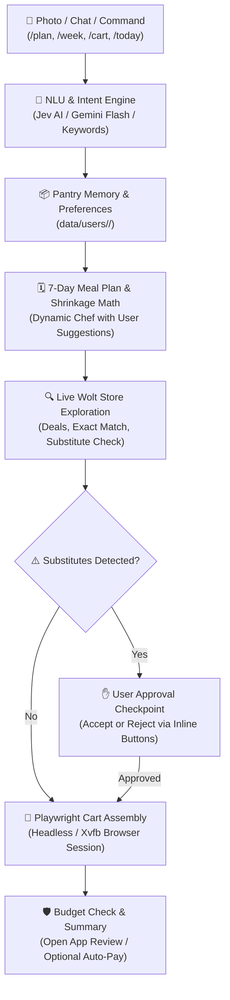

# 🛒 Wolt Smart Pantry & Grocery Assistant

[](https://github.com/)
[](https://playwright.dev/)
[](https://aistudio.google.com/)
[](LICENSE)

An intelligent agentic grocery assistant, meal planner, and browser automation engine for **Wolt** (Tallinn, Estonia). It transforms pantry & fridge photos into balanced 7-day culinary meal plans with thermal cooking shrinkage math, accommodates custom meal suggestions, and automates exact Wolt cart assembly via Playwright.

---

## 🌟 Key Capabilities

1. 📸 **Visual Pantry & Food Vision Audit**:
   - Audits photos of your fridge, pantry shelves, or cooked meals using Gemini Multimodal Vision.
   - Automatically logs consumed meals or restocks purchased groceries into virtual pantry memory.
2. 🥩 **Nutritional Thermal Cooking Shrinkage Math**:
   - Accounts for the standard 25–35% cooking shrinkage ($W_{\text{raw}} = \frac{W_{\text{cooked}}}{0.70}$), ensuring you purchase genuine meat cuts and fresh proteins (no cold cuts/mortadella).
3. 🗓️ **Dynamic 7-Day Meal Planning with Custom Suggestions**:
   - Generates gourmet, realistic 7-day plans (Monday–Sunday) following 4 freshness tiers (ultra-fresh $\rightarrow$ resilient produce $\rightarrow$ hearty proteins $\rightarrow$ fridge clearing).
   - Supports personalized suggestions via `/plan [sugerencias]` or `/week [sugerencias]` (e.g. `/plan comida mexicana alta en proteína`, `/week platos italianos y más salmón`).
4. 🧅 **Exact Product Matching & Substitute Approval**:
   - Strictly enforces exact product title matching to avoid unintended replacements (e.g. green onions instead of yellow onions).
   - If only partial substitutes are found, the bot pauses and asks for user approval (`[✅ Aceptar Sustituto(s)]` / `[❌ Descartar Sustituto(s)]`).
5. 👥 **Multi-User Isolation & Private API Keys**:
   - Each Telegram user has an isolated environment in `data/users/<user_id>/` (distinct Wolt browser profiles, pantry memory, dietary preferences, and meal plans).
   - **Private API Keys**: Each user configures their own personal Gemini (`/setkey`) or Jev AI (`/setjev`) key. No shared global API keys.
6. 🛡️ **Budget Protection & Checkout Safety**:
   - Configurable budget ceiling (`/budget <amount>`). If the cart exceeds the limit, **Auto-Pay is automatically blocked** and left for manual review in your phone app.
7. 🥧 **Raspberry Pi 5 Ready**:
   - Full automated deployment suite (`scripts/deploy_pi.py`) running headless with systemd (`wolt-bot.service`) and Xvfb virtual display.

---

## 🏗️ Architecture & Domain Modularization

The codebase is split into clean, modular domain packages under `wolt_core/`:

```
wolt-smart-pantry/
├── wolt_core/                    # Modular domain core
│   ├── config.py                 # Multi-user profile management & preferences
│   ├── gemini.py                 # Gemini LLM, Multimodal Vision & NLU intent engine
│   ├── pantry.py                 # Virtual pantry memory & stock deductions
│   ├── planner.py                # 7-day meal planner, shrinkage math & candidates
│   ├── browser.py                # Playwright Wolt browser automation & cart assembly
│   └── __init__.py               # Core package exports
├── wolt_manager.py               # Unified CLI runner & backwards-compatible bridge
├── telegram_bot.py               # Multi-user Telegram bot bridge & callback handlers
├── scripts/
│   ├── deploy_pi.py              # Raspberry Pi 5 SSH deployment & systemd manager
│   └── test_jev.py               # NLU intent routing verification script
└── data/users/<user_id>/         # Isolated per-user state storage
```



---

## 🚀 Quick Start

### 1. Prerequisites
- Python 3.10+
- Git
- Chromium (installed via Playwright)

### 2. Local Setup

```bash
# Clone the repository
git clone https://github.com/AndresCUd/wolt-smart-pantry.git
cd wolt-smart-pantry

# Create and activate virtual environment
python -m venv .venv
# Windows (PowerShell):
.\.venv\Scripts\Activate.ps1
# Linux/macOS:
source .venv/bin/activate

# Install dependencies and Playwright browser
pip install -r requirements.txt
playwright install chromium
```

### 3. Telegram Bot Configuration

1. Create a bot using [@BotFather](https://t.me/BotFather) on Telegram and copy the Bot Token.
2. (Recommended) Get your Telegram User ID from [@userinfobot](https://t.me/userinfobot) to restrict access.
3. Copy `.env.example` to `.env`:
   ```bash
   cp .env.example .env
   ```
4. Fill in `.env`:
   ```env
   TELEGRAM_BOT_TOKEN=123456789:ABCdefGhIJKlmNoPQRsTUVwxyZ
   TELEGRAM_ALLOWED_USERS=123456789
   DEFAULT_STORE=wolt-market-maakri
   DEFAULT_CITY=tallinn
   DEFAULT_COUNTRY=est
   TIMEZONE=Europe/Tallinn
   DAILY_MENU_TIME=09:00
   ```

### 4. Run the Bot
```bash
python telegram_bot.py
```

---

## 📱 Telegram Commands Guide

| Command | Description |
| :--- | :--- |
| `/start` | Welcome guide, quick action menu, and system overview. |
| `/user` (or `/profile`) | View your profile, private API keys status, budget, and active settings. |
| `/today` (or `/menu`) | Today's scheduled meals, raw-to-cooked portions & freshness alerts. |
| `/week [sugerencias]` | Full 7-day meal schedule. Pass suggestions to customize (e.g. `/week platos mexicanos`). |
| `/plan [sugerencias]` | Audits pantry memory and generates a 7-day meal plan & Wolt cart with suggestions. |
| `/setkey <api_key>` | Configure your private free Google Gemini API key ([AI Studio](https://aistudio.google.com)). |
| `/setjev <api_key>` | Configure your private Jev AI key for sub-200ms decision routing ([Jev AI](https://jev-ai.pro)). |
| `/pref` | Manage dietary profile, allergies (gluten, lactose, nuts), and household size. |
| `/settings` | Configure 1-click Auto-Pay, maximum budget ceiling, and store venues. |
| `/budget <amount>` | Set maximum shopping budget ceiling (e.g. `/budget 50` or `/budget 0` to disable). |
| `/autopay [on\|off]` | Toggle automated payment submission. |
| `/pantry` | Shows active tracked pantry staples, proteins, produce, and purchase history. |
| `/stock` | Restock items manually (`/stock eggs 10`) or upload a photo with caption `/stock`. |
| `/deals` | Scans Wolt Market for active promotional discounts. |
| `/cart Item:Qty` | Adds specific items directly to your Wolt cart (e.g. `/cart Banaan:6 Rukola:1`). |
| `/wolt` | Checks your user's isolated Wolt login session and venue. |
| `/store <slug> [city]` | Change your preferred Wolt store venue. |
| `/stop` | Abort active cart creation, scan, or proposal. |
| `/logs [lines]` | View live execution logs directly from Telegram. |

---

## 🥧 Raspberry Pi 5 Remote Deployment

The repository includes an SSH deployment CLI in [`scripts/deploy_pi.py`](file:///c:/Users/andre/Documents/antigravity/calm-hawking/scripts/deploy_pi.py):

```bash
# 1. First-time setup on Raspberry Pi (installs system packages, Xvfb, Python venv, systemd service)
python scripts/deploy_pi.py setup

# 2. Deploy latest code updates and restart bot service
python scripts/deploy_pi.py deploy

# 3. Check service status
python scripts/deploy_pi.py status

# 4. View live logs from the Pi
python scripts/deploy_pi.py logs -n 50

# 5. Authorize Wolt session on the Pi via remote browser window
python scripts/deploy_pi.py login
```

---

## 💻 CLI Usage (Standalone)

```bash
# Search items in store
python wolt_manager.py search --store wolt-market-maakri --queries "hakkliha" "banaan" "rukola"

# Scan live discounts
python wolt_manager.py deals --store wolt-market-maakri

# Add custom items to cart
python wolt_manager.py add --store wolt-market-maakri --items "Banaan:6" "Rukola:1" "Muna:10"

# Check pantry memory status
python wolt_manager.py pantry --action status
```

---

## 📄 License & Disclaimer

This project is licensed under the MIT License.

*Disclaimer: This is an independent open-source automation tool. It is not affiliated with, endorsed by, or sponsored by Wolt Enterprises Oy or any of its subsidiaries.*
