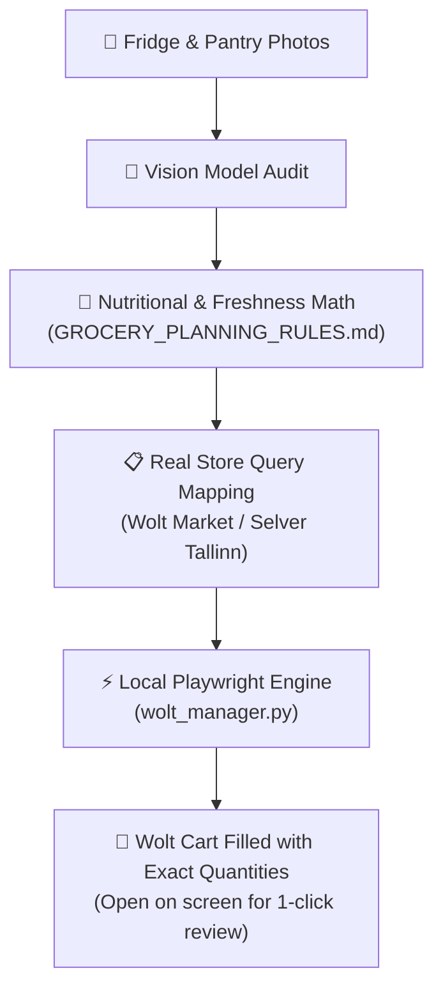

# 🛒 Wolt Smart Pantry & Grocery Assistant

[](https://github.com/)
[](https://playwright.dev/)
[](LICENSE)

An intelligent agentic grocery assistant and automation engine for **Wolt** (Tallinn, Estonia). It transforms kitchen inventory photos into a balanced, zero-waste 7-day meal plan and automatically assembles your shopping cart with exact quantities via Playwright.

---

## 🌟 Key Capabilities

1. 📸 **Visual Pantry & Fridge Audit**: Inspects photos of your fridge, freezer, and pantry to detect in-stock proteins, carbohydrates, and spices. Never repurchases items you already have.
2. 🥩 **Nutritional Thermal Shrinkage Math**: Accounts for the standard 25–35% water/fat loss during cooking ($W_{\text{raw}} = \frac{W_{\text{cooked}}}{0.70}$), ensuring you buy adequate portions of genuine fresh meat (no cold cuts/mortadella).
3. 🥗 **4-Tier Freshness Hierarchy**: Structures weekly meals according to ingredient shelf-life (Tier 1 perishables in Days 1–3, resilient produce and pantry staples in Days 4–7) to eliminate food waste.
4. 🤖 **Robust Browser Automation**:
   - Uses local persistent sessions (`.wolt_profile`) to bypass bot detection and OAuth friction.
   - Adjusts item quantities accurately using product modal steppers (`+` buttons).
   - Automatically handles address confirmation popups and dismisses "Continue previous order" prompts.
   - Real-time cart price increment verification in euros.
5. 🛡️ **Safe Checkout Guarantee**: The engine builds the cart and displays the final order summary in an open browser window. It **never** clicks payment or submits orders automatically.

---

## 🏗️ Architecture



---

## 🚀 Getting Started

### 1. Prerequisites
- Python 3.10+
- Git

### 2. Installation

```bash
# Clone the repository
git clone https://github.com/your-username/wolt-smart-pantry.git
cd wolt-smart-pantry

# Create and activate virtual environment
python -m venv .venv
# On Windows (PowerShell):
.\.venv\Scripts\Activate.ps1
# On Linux/macOS:
source .venv/bin/activate

# Install dependencies and Chromium browser
pip install -r requirements.txt
playwright install chromium
```

### 3. One-Time Authentication Setup

Run the login helper to initialize your persistent session profile:

```bash
python wolt_manager.py login
```

- A browser window will open at `https://wolt.com/en/discovery`.
- Log in to your Wolt account (via Google, Apple, or Email).
- Confirm your default delivery address in Tallinn.
- Close the browser window. Your session is now saved locally in `.wolt_profile/`.

---

## 🛒 Usage

### 1. Live Store Catalog Exploration & Offers Inspection

Discover available products, exact packaging weights, and live prices before ordering:

```bash
# Search specific categories or items in the store:
python wolt_manager.py search --store wolt-market-maakri --queries "hakkliha" "kanafilee" "banaan" "paprika" "rukola"

# Scan store for active discounts and promotional deals:
python wolt_manager.py deals --store wolt-market-maakri
```

### 2. Automated Cart Assembly

```bash
# Add custom items with explicit quantities (using 'Item:Qty' format):
python wolt_manager.py add --store wolt-market-maakri --items "Banaan:6" "Rakvere homemade minced meat, 400g:2" "Rukola:1" "Paprika punane:2"

# Pass calculated shopping list via JSON:
python wolt_manager.py add --store wolt-market-maakri --json-items "[{\"query\": \"Banaan\", \"qty\": 6}, {\"query\": \"Riivjuust mozzarella\", \"qty\": 1}]"

# Run sample demonstration grocery plan:
python wolt_manager.py add --store wolt-market-maakri --sample

### 3. Persistent Virtual Pantry Memory (No Photos Needed for Repeat Weeks)

Track your active inventory across weekly orders so you don't need to re-photograph your pantry every week:

```bash
# View active tracked staples, fresh proteins, and purchase history:
python wolt_manager.py pantry --action status

# Manually record or update items in memory:
python wolt_manager.py pantry --action record --items "Olive oil 1L:1" "Sibul 1kg:1"

# Reset virtual memory state:
python wolt_manager.py pantry --action clear
```

---

## 🧠 Installing as an Antigravity Agent Skill

To use this with [Google Antigravity](https://github.com/google):

1. Copy the skill package to your Antigravity skills directory:
   ```bash
   # Global installation:
   cp -r .agent/skills/wolt-smart-pantry ~/.gemini/config/skills/wolt-smart-pantry
   ```
2. In any Antigravity conversation, simply upload your fridge/pantry photos and ask:
   > *"Plan my meals for the week and put the groceries in my Wolt cart."*

The agent will automatically read `SKILL.md`, calculate portions following `GROCERY_PLANNING_RULES.md`, and execute `wolt_manager.py`.

---

## 📁 Repository Structure

```
├── .agent/
│   └── skills/
│       └── wolt-smart-pantry/
│           ├── SKILL.md                   # Antigravity skill specification
│           ├── references/
│           │   └── GROCERY_PLANNING_RULES.md # Mathematical & culinary framework
│           └── scripts/
│               └── wolt_manager.py        # Playwright automation script
├── GROCERY_PLANNING_RULES.md              # Project reference rules
├── wolt_manager.py                        # Standalone CLI automation script
├── requirements.txt                       # Minimal dependency manifest
├── .gitignore                             # Ignores credentials, profiles, caches
└── README.md                              # Documentation
```

---

## 📄 License & Disclaimer

This project is licensed under the MIT License.

*Disclaimer: This is an independent open-source automation tool. It is not affiliated with, endorsed by, or sponsored by Wolt Enterprises Oy or any of its subsidiaries.*
